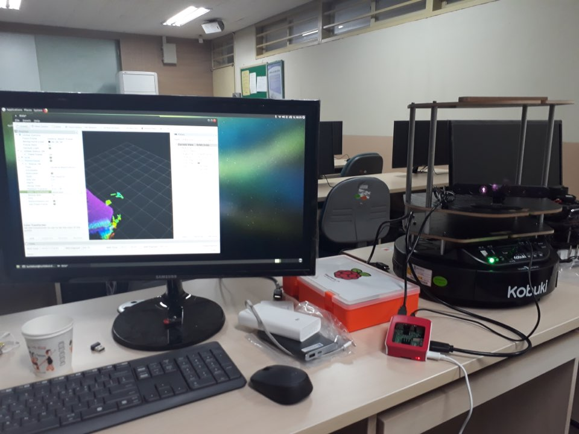
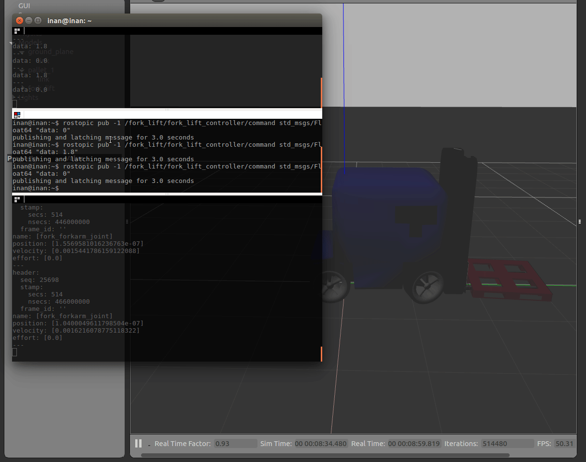

# Portfolio
동의대컴퓨터소프트웨어공학 4학년 정인환 포트폴리오

## 연구실

동의대학교 이종민 교수님의 Parallel Computing & Wireless Networks & Robot 연구실 소속

###### 2018년 5월~ 

#### 연구 주제
- ROS를 이용한 로봇 자율 주행 및 SLAM, 네비게이션 스택 시뮬레이션(feat. gazebo, rviz)
- turtlebot2 자율주행 및 OpenCV를 통한 비전 처리
- Erle-Rover 자율주행 및 네비게이션 스택
- 소프트웨어 품질 관리
- git을 이용한 형상관리
- blender를 이용한 gazebo 모델링
- [엘리베이터 이용 가능한 다층 이동 로봇 논문에 대한 기능 학습](http://www.riss.kr/search/detail/DetailView.do?p_mat_type=be54d9b8bc7cdb09&control_no=c070c6e21caaba51ffe0bdc3ef48d419)

#### 봉사활동 및 대외활동
- 2018.7.14, 소프트웨어 콘서트, 보조강사(파이썬 교육)
- 2018.7.23~26, 우암초등학교 3D펜 강의, 보조강사

#### 수상경력
- 2019.11 크라우드테스팅 경진대회, 부산IT융합부품연구소, 대상 [전자신문 뉴스 원본](https://www.etnews.com/20191115000335)

#### 자격증
- 2018.08	ISTQB foundation level, International Software Testing

#### 경험
- 언어: C,C++, java, python, html, css, js, jsp, sql
- 운영체제: Windows, Linux, mac OS
- 임베디드: Arduino Uno, Erle-brain, Raspberry PI
- 기타: 안드로이드, OpenGL 
- 백엔드: Spring, Spring boot, flask, Nodejs

## 프로젝트 경험

#### C on Linux
- [리눅스에서 빌드하는 방법(정적, 공유, 동적 라이브러리, MAKE)](https://github.com/InhwanJeong/lab2)
- [파일처리, 프로세스와 시그널, 프로세스간 통신](https://github.com/InhwanJeong/lab3)
- [소켓, 스레드, GUI](https://github.com/InhwanJeong/lab4)
- [나만의 쉘 만들기- 2인 프로젝트](https://github.com/InhwanJeong/Shell-Program)
  - 구현한 기능 (1) csh, bash 등에서처럼 인터럽트키 (SIGINT: Ctrl-C, SIGQUIT: Ctrl-Z) 가 동작하도록 프로그램을 수정하시오.
    - 인터럽트를 이용하여 시그널을 조작해 원하는 키보드키에 원하는 기능을 하도록 조작하였습니다.
  - 구현한 기능 (2) 파일 재지향 (>, <) 기능이 가능하도록 프로그램을 수정하시오.
    - 쉘 안에서 파일 재지향 기능을 사용할 수 있도록 기능을 추가하였습니다.
  - 구현한 기능 (3) 백그라운드 동작 &
    - 직접 만든 쉘 프로그램 내에서 백그라운드 기능이 동작할 수 있도록 하였습니다.
 
#### Andriod
- [DayLight 프로젝트 - 4인 프로젝트](https://github.com/InhwanJeong/DayLight)
  - 구현한 기능 (1):오픈소스인 스와이프레이아웃을 이용하여 일정에 공유, 업데이트, 삭제 기능을 추가하였습니다.([이용한 스와이프 오픈소스](https://github.com/chthai64/SwipeRevealLayout)
  - 구현한 기능 (2): 테이블 레이아웃을 이용하여 메인화면을 구성했습니다.
  - 그외 아이디어 및 여러가지 작은 기능들 구현
 
#### ROS - UP프로세스 기반 진행(소프트웨어 국제표준 ISO/IEC/IEEE 29119)
- [ROS 미로탈출 및 도로주행 프로젝트 - 4인 프로젝트](https://github.com/InhwanJeong/Ros-project)
  - 구현한 기능(1): 터틀봇 이동 및 회전을 위한 컨트롤 기능 설계 및 구현
  - 구현한 기능(2): 라이더를 이용하여 벽과 거리를 측정하는 기능 설계 및 구현
  - 구현한 기능(3): 막힌길 진입 시 지나온 길로 되돌아 가는 기능 설계 및 구현
  - 구현한 기능(4): 터틀봇 미로 탈출 시 처음 위치로 되돌아 가는 기능 설계 및 구현
  - 구현한 기능(5): 터틀봇이 라인을 인식하여 앞으로 이동하는 기능 구현
  - 구현한 기능(6): 터틀봇에 새로운 카메라 장착
  
- 요구 분석 - 인수 테스트,시스템 테스트 - 유스케이스 사용
  - 1. 유스케이스 다이어그램 작성(시스템 범위; 이 프로젝트에서 해야할 일의 범위)
    - (1) 액터 식별
    - (2) 시스템 기능 식별(유스케이스)
  - 2. 고수준 유스케이스(모든 유스케이스에 대하여 작성)
  - 3. 확장 유스케이스(일부 유스케이스에 대하여 작성)
  - 4. 도메인 모델(개념 수준 클래스 다이어그램)
    - (1) 연관 식별
    - (2) 개념적 클래스
    - (3) 애트리뷰트
  - 5. 시스템 순차 다이어그램
  - 6. 시스템 오퍼레이션(클래스 메소드를 정의)
  - 7. 시스템 오퍼레이션 정의(메소드 간 연결)
- 설계 - 통합테스트
  - 1. 통신 다이어그램(명세 수준 클래스 다이어그램)
  - 2. 설계 수준 클래스 다이어그램 작성
- 구현 - 단위테스트
  - 1. GRASP 설계 패턴 적용
  - 2. 디자인 패턴 적용
  
#### Java
- [내손을 자바 프로젝트 - 5인 프로젝트](https://github.com/InhwanJeong/Take_my_hand)
  - 구현한 기능 (1) 소켓을 이용하여 공공데이터 API를 받아와서 원하는 데이터만 가져갈 수 있도록 파싱 기능 설계 및 구현
  - 구현한 기능 (2) 아파치 웹서버 구축 및 PHP를 이용하여 동적페이지 생성
  - 구현한 기능 (3) 카카오 API(JavaScripts)를 활용하여 지도 생성
  - 구현한 기능 (4) 지도 위에 들어갈 아이콘 제작 및 PHP, javascripts를 이용하여 지도 위 아이콘 생성

  
#### 블로그
https://inhwanjeong.tistory.com/

